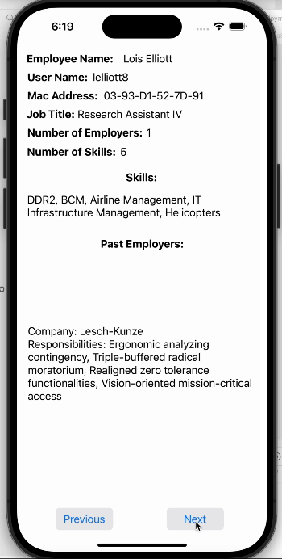

# Employee-Management-App
 <div align="left">
	
  
</div>

This iOS application allows users to manage employee information fetched from a JSON file. Users can navigate through the list of employees, viewing details such as employee name, username, MAC address, current job title, skills, past employers, and more.

## Installation
1. Clone this repository to your local machine.
2. Open the project in Xcode.
3. Build and run the app on a simulator or physical device.

## Features
- Display employee information fetched from a JSON file.
- Navigate through employees using "Next" and "Previous" buttons.
- View details of each employee, including:
  - Employee name
  - Username
  - MAC address
  - Current job title
  - Skills
  - Past employers and responsibilities

## Usage
1. Upon launching the app, the first employee's information is displayed.
2. Use the "Next" button to view the details of the next employee.
3. Use the "Previous" button to view the details of the previous employee.
4. Details of each employee are updated accordingly on the UI.

## Demo


## JSON Data Structure
**The JSON data provided for this application was obtained from Full Sail University.**

```json
[
  {
    "employeename": "String",
    "username": "String",
    "macaddress": "String",
    "current_title": "String",
    "skills": ["String"],
    "past_employers": [
      {
        "company": "String",
        "responsibilities": ["String"]
      }
    ]
  }
]
```

## Technologies Used
- Swift: The programming language used for developing the iOS application.
- Xcode: The integrated development environment (IDE) used for coding, debugging, and testing the app.
- UIKit: The framework used for building the user interface of the app.
- JSONSerialization: Used for parsing JSON data retrieved from the file.
- iOS Simulator: Used for testing the app on different iOS device configurations.

### You can contribute by:
-  Reporting bugs
-  Suggesting new features
-  Submitting pull requests to improve the codebase
